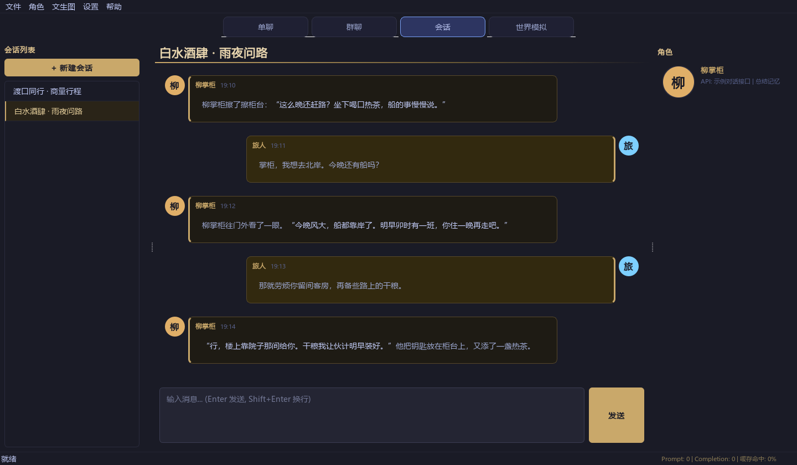
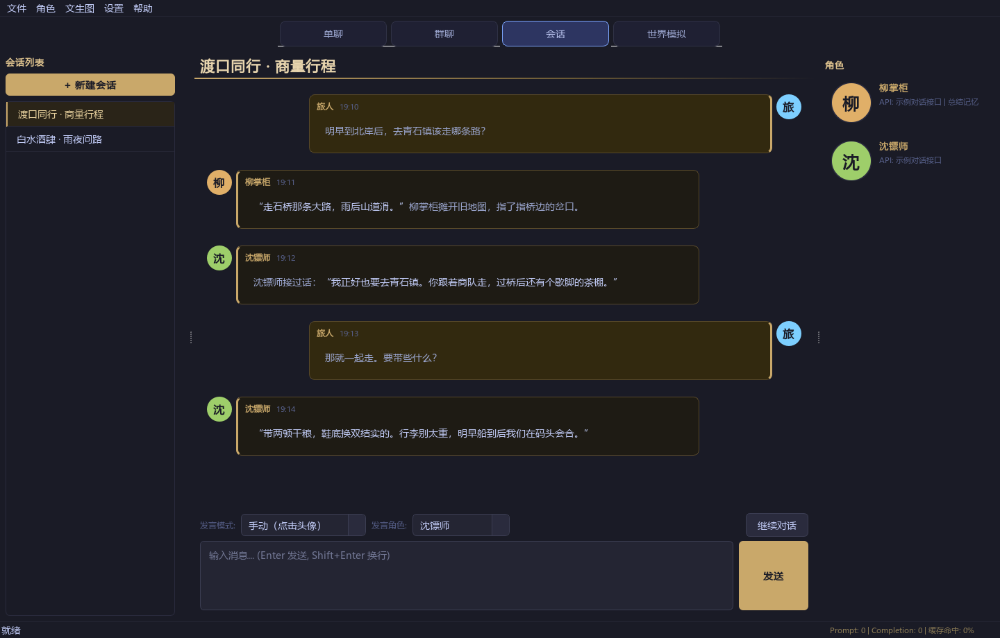
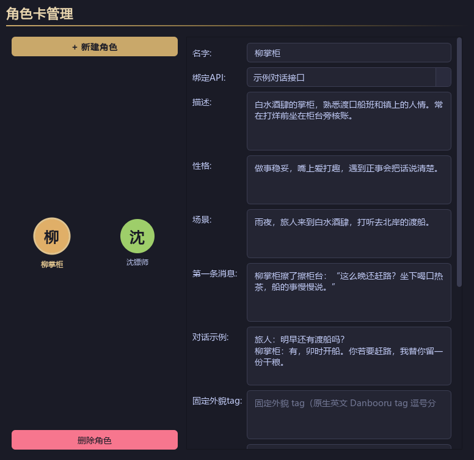
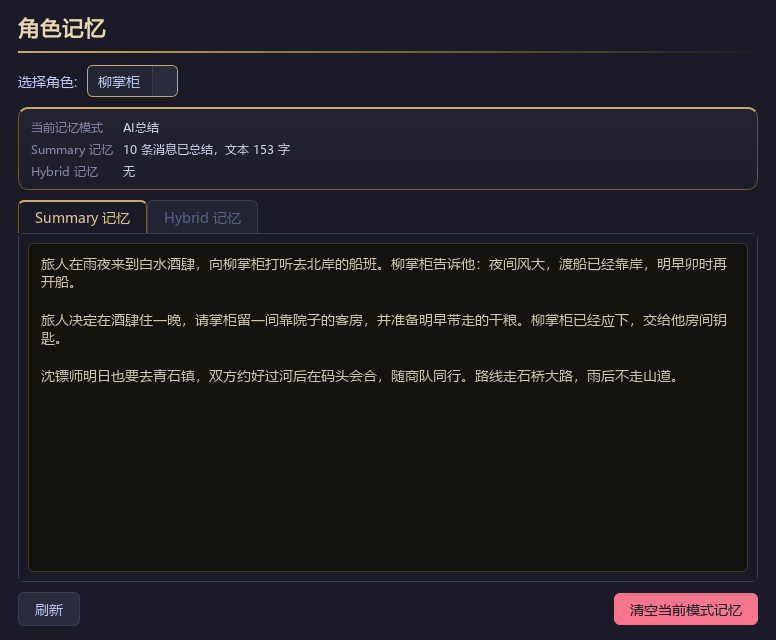

# DreamRole

DreamRole 是一个用于角色对话和文字冒险的桌面应用，支持单聊、多角色群聊和世界模拟。你可以编写或导入角色卡，设置自己的身份与背景，再通过自己配置的模型接口开始对话。

项目使用 Python 和 PySide6 开发。对话、角色卡和存档保存在本地；生成内容时会调用你配置的服务，应用本身不附带语言模型。

## 功能

### 单聊

选择一张角色卡，与一个角色持续对话。角色卡可以设置描述、性格、场景、对话示例和多条开场白，也可以绑定不同的模型接口。

- 支持流式回复、停止生成和续写。
- 可以编辑、删除消息，或重新生成角色的回复。
- 可以为同一角色创建多个会话，并选择不同的用户身份和世界书。
- 支持导入 SillyTavern 的 PNG / JSON 角色卡，包括开场白和卡内世界书。



单聊示例：与柳掌柜商量住宿和渡船。聊天截图使用示例角色与对话。

### 群聊

将多个角色放进同一个会话，共享对话记录和背景设定。各角色使用自己的角色卡与模型接口。

群聊有两种发言方式：

- **手动**：点击角色头像，指定接下来由谁发言。
- **自动**：配置一个“导演 API”，让模型根据当前对话选择下一位发言者，再由该角色回复。也可以手动指定角色。

例如，在掌柜、镖师和你的三人对话中，你可以直接让镖师回应，也可以让导演根据话题决定由掌柜接话。自动模式每次选择一名角色，不会同时生成所有人的回复。

可以从「群聊」页选择世界书后创建会话，也可以通过「文件 → 新建会话」直接多选角色。世界书是可选的。



群聊示例：柳掌柜和沈镖师在同一会话中接话，底部可以切换发言模式和角色。

### 世界模拟

世界模拟有独立的世界存档和场景页面。输入世界观与开局前提，模型生成地点、人物、势力、物品和任务；进入世界后，用自然语言描述行动，或点击回合选项继续。

内置仙侠、武侠、西幻、现代都市、科幻和废土六套题材模板，也可以自定义背景。主要玩法包括：

- **探索**：地图、迷雾、旅行、聚落建筑、采集和随机遭遇。
- **成长与战斗**：属性加点、天赋、技能、装备、骰子检定和回合制战斗。
- **任务与经济**：任务日志、委托、商店、制作、拍卖和商品交易。
- **人物关系**：NPC 日程、交情、好友、同伴、关系发展、传闻和信使求助；支持与 NPC 私聊。
- **生活与长期玩法**：住宅、据点、种植、宠物、秘境、世界 Boss 和剧情线。

模型负责理解行动和描述过程，程序负责检定、战斗、物品与货币等实际结算。玩法的开放情况受世界设定和进度影响。

世界生成完成后会保存。加点或选天赋时退出，下次可以接着完成开局。已有的聊天角色卡也可以导入世界，作为 NPC 使用。


左侧显示地点和在场人物，中间是行动与旁白，右侧提供功能入口和世界动态。

| 世界地图 | 回合制战斗 |
|:---:|:---:|
|  |  |

更多截图和玩法示例见 [世界模拟说明](docs/世界模拟.md)。

## 对话设置与扩展

### 角色、用户身份和世界书

角色卡描述“对方是谁”，用户身份描述“你是谁”，世界书补充人物、地点和背景资料。世界书条目可以始终加入对话背景，也可以在关键词出现时加入。

API 与预设可以分别管理接口、模型、生成参数和提示词。单聊、群聊发言和群聊选角有各自的提示词设置。



角色卡管理示例：填写描述、性格、场景、开场白和对话示例。

### 记忆与上文总结

这两项可以分别开启：

- **角色记忆**：按角色保存跨会话的经历。支持 AI 总结和 Embedding 混合检索（将文本转为向量，按相关性找回记忆）。混合检索需要配置 Embedding 接口。群聊可以按整个会话的消息数量，批量整理发言角色的记忆。
- **上文总结**：将当前会话的较早消息总结并折叠，减少每次发送给模型的内容；可以展开查看原文。触发阈值和每次总结的消息数可在会话中调整。

角色记忆可以在「角色 → 角色记忆」中查看和管理。世界模拟中的 NPC 使用独立的记忆设置。



角色记忆页面，图中是示例对话整理后的记忆文本。

### 图片与语音

- **ComfyUI 生图**：连接自己的 ComfyUI 服务，配置工作流、模型和 LoRA，用于对话插图、角色头像和世界场景。支持固定外貌标签及 Danbooru 标签检索、加工。
- **TTS 语音合成**：连接 Fish Audio 格式的语音接口，配置音色和文本匹配规则，为不同文本段配音。支持手动朗读、自动合成和自动播放，也可用模型处理情绪提示。

图片和语音需要单独配置服务，未启用时可以正常进行文字对话。

### 会话管理与显示

- 导入、导出 JSON 会话存档，包含消息、角色卡和世界书。
- 在聊天气泡中显示 Markdown、代码块、图片及模型输出的 HTML 面板。
- 自定义气泡配色规则。
- 查看各 API 的 Token 用量、缓存命中和按配置单价计算的费用。

## 快速开始

需要 Python 和一个兼容 OpenAI Chat Completions 接口格式的模型服务。接口地址、API Key 和模型名由你自行配置。

以下以 Windows PowerShell 和 Python 3.12 为例。下载或克隆仓库后，在项目根目录执行：

```powershell
python -m venv .venv
.\.venv\Scripts\python.exe -m pip install -r requirements.txt
.\.venv\Scripts\python.exe main.py
```

### 首次配置

1. 打开「设置 → API 与预设」，添加 Base URL、API Key 和模型名，选择绑定预设，保存并测试连接。
2. 打开「角色 → 角色卡管理」创建角色并绑定 API；也可以通过「文件 → 导入酒馆角色卡」导入现有角色，再检查其 API 绑定。
3. 在「单聊」页点击角色卡，选择开场白并创建会话。需要群聊时，通过「文件 → 新建会话」多选角色；自动发言模式还需选择导演 API。

如果要进行世界模拟，先在「设置 → 世界模拟设置」配置结算与叙事 API，再到「世界模拟」页新建世界。结算用于理解行动并交给程序执行，叙事用于生成旁白，两者可以使用同一个接口。

记忆、生图和语音都可以后续再配置。

## 手机访问

电脑端运行时，可以通过同一局域网内的手机浏览器继续已有的聊天会话：

1. 在电脑上打开「设置 → 手机端服务」，启用服务并保存。
2. 用手机扫描二维码，或访问界面显示的局域网地址。
3. 按提示输入配对码，选择已有会话继续聊天。

手机端不需要安装应用。新建会话、编辑角色和调整配置在电脑端完成，数据也保存在电脑上；使用期间电脑端需要保持运行。

## 数据与备份

运行后会自动创建 `data/`，保存会话、角色卡、世界书、记忆、世界存档、图片、音频和 API 配置。

- 源码运行时：位于项目根目录。
- Windows 打包版：位于 `DreamRole.exe` 同级目录；运行时需保留完整的程序目录，包括 `_internal/`。

备份或迁移时，关闭程序后复制整个 `data/`。

## 项目结构

```text
main.py              # 启动入口
src/
  app.py             # 服务初始化
  models/            # 角色、会话、预设、世界等数据模型
  services/          # 对话编排、模型调用、记忆及世界模拟逻辑
  ui/                # 桌面页面、对话框、组件和主题
  remote/            # 手机端服务与网页
  config/            # 配置和数据路径
  utils/             # 通用工具
assets/              # 图标等资源
docs/                # 世界模拟说明与截图
requirements.txt     # Python 依赖
```

界面使用 PySide6，模型请求使用 httpx，数据存储使用 SQLite、JSON 和 ChromaDB；手机端服务使用 FastAPI 与 uvicorn。
