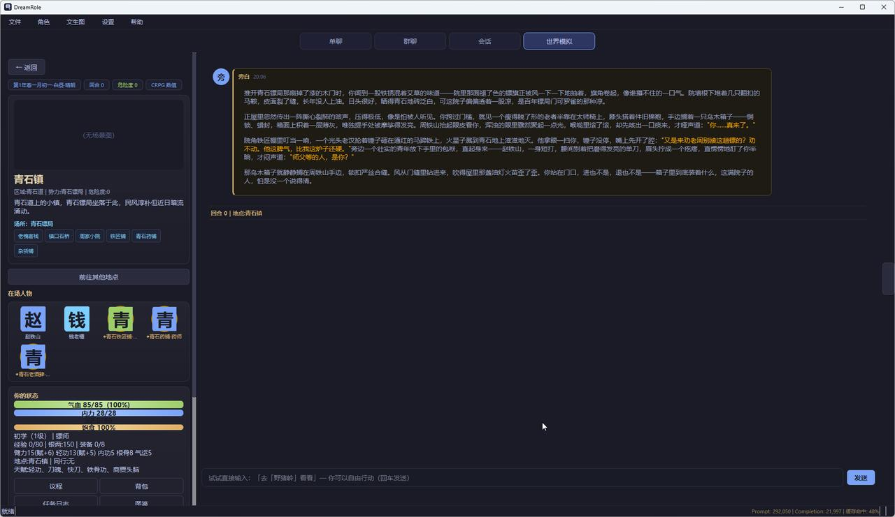
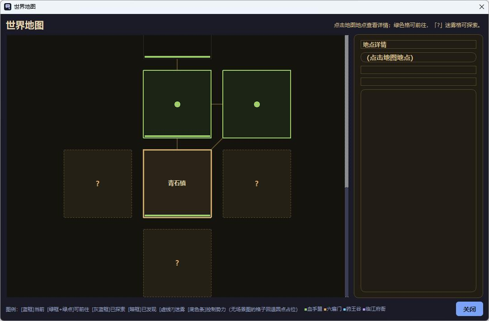
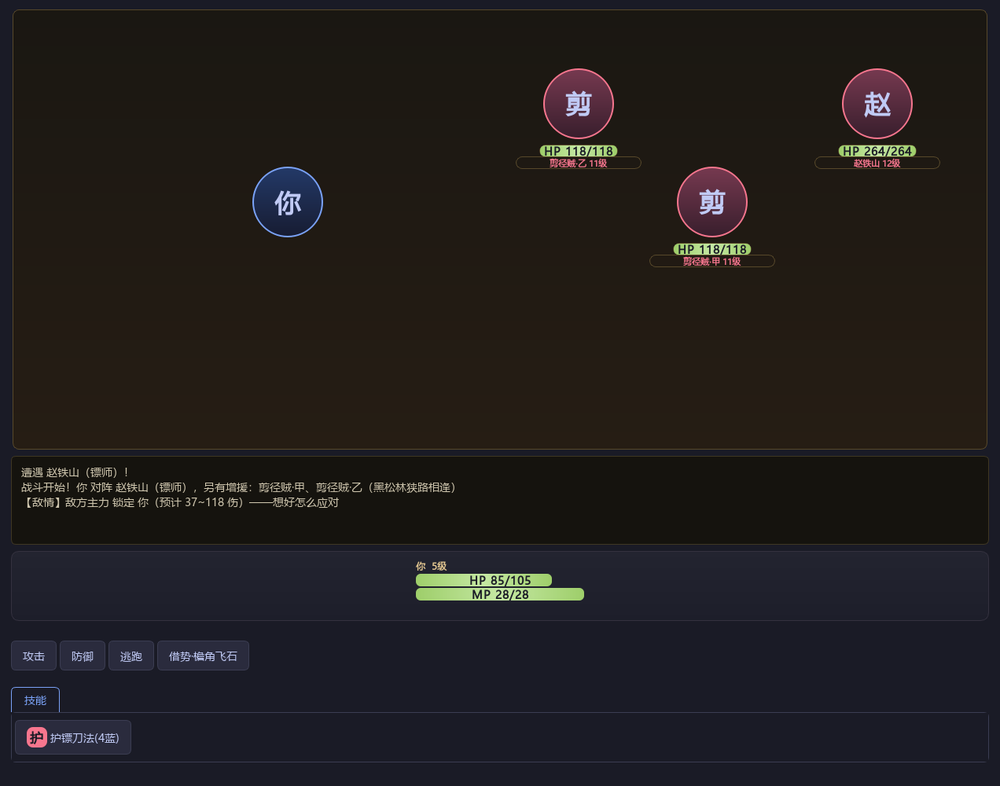
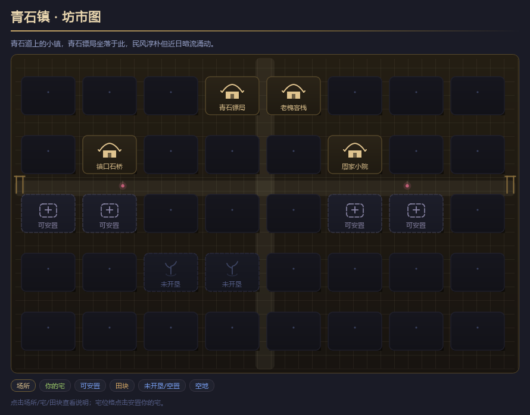

# DreamRole · 桌面端 AI 跑团引擎

> 你用一句话起一个世界观，LLM 负责生成地图、NPC、势力、任务与叙事；一套确定性数值引擎负责骰子、战斗、经济与时间流逝。**你说人话，它跑世界。**



左栏是地点与在场人物，中间是旁白叙事流，右栏是功能入口与「动态」信息流。

## 它能玩什么

- **一键生成世界**：仙侠 / 武侠 / 西幻 / 现代都市 / 科幻 / 废土六套题材模板，填一句前提（比如「我是青石镖局最后的趟子手，接了一趟不许失败的暗镖」），LLM 分段产出 NPC、势力、地点、物品、任务与世界书，先预览再保存。
- **说人话跑团**：每条输入就是一回合。说话、行动、砍价、问路全用自然语言，引擎在叙事之下跑真实的骰子检定、掉落与账本——LLM 无法凭空送你一件神装。
- **NPC 不等你**：他们有自己的日程、念头和目的地。反派会在你进林子后自主跟进拦路，这不是剧本，是行为引擎自己走出来的伏击。
- **战斗**：野外遭遇结算成带数值的战报卡；挑战强敌进入回合制战斗对话框，技能 / 防御 / 物品 / 撤退逐回合操作。
- **经济闭环**：采集 → 卖钱 → 买装备 → 打更强的怪；大城市还有周期性拍卖会与大宗商品股市。
- **生活系统**：宠物、住宅、好友、信使、据点；高等级解锁秘境、世界 Boss 与剧情线。
- **手机端联动**：内置 FastAPI 远程服务，扫码即可以从手机接着玩。

| 世界地图（迷雾探索） | 回合制战斗 |
|:---:|:---:|
|  |  |

| 聚落建筑网格（自绘，画风随题材与规模适配） |
|:---:|
|  |

## 快速开始

需要 Python 3.10+，以及一个兼容 OpenAI 接口格式的 LLM API（中转站均可）：

```bash
pip install -r requirements.txt
python main.py
```

首次启动后在「API 与预设」中填入你的接口地址与密钥即可。所有数据（存档、密钥、图片库）都保存在本地 `data/` 目录，仓库不含任何用户数据。

## 技术栈

**GUI** PySide6 (QSS)｜**HTTP** httpx｜**Token** tiktoken｜**存储** SQLite + JSON + ChromaDB｜**远程** FastAPI + uvicorn｜**打包** PyInstaller

## 目录结构

```
main.py              # 入口
src/
  models/            # dataclass 数据模型（from_dict 强类型白名单）
  services/          # LLM 客户端、上下文构建、世界模拟各引擎（战斗/经济/任务/剧情线…）
  ui/                # 界面（tabs / dialogs / widgets / 主题）
  remote/            # 手机端 Web 服务
  utils/  config/
assets/              # 应用图标等资源
docs/                # 项目文档
```

## 了解更多

完整的玩法图文介绍（40 余张真实试玩截图）见 **[docs/世界模拟.md](docs/世界模拟.md)**。
